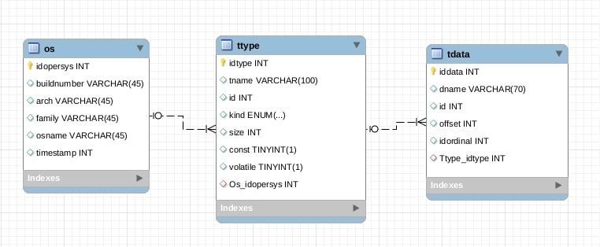

# **VERGILIUS PROJECT** [](https://travis-ci.com/RevJay/vergilius-project)

#### **Implementation details**

Build tool: **Gradle** 

Language: **Java 8**

RDBMS: **MySQL 5.7** 

Frameworks: **SpringBoot 1.5.8, Bootstrap 4** 

Template engine: **Jade/Pug**

## Back-end

### Database design
Database schema reflects a structure of [**YAML file**](#YAML-files) and consists of three tables:
- **“os”** stores data about kernels (operating systems); 
- **“ttype”** stores types such as different structures, unions, enumerations. 
- **“tdata”** stores types fields. 



Relations between these tables imply that each kernel has a certain number of types and each type has a certain number of fields (however, some types might not contain any fields). 

|Table | Columns  | Description | 
| ---- | -------- | ------------|
| **OS** | idopersys | primary key | 
|| arch | architecture (x86 or x64) |
|| buildnumber | kernel build number | 
|| family | version name (Windows 10 or Windows Vista etc.) |
||osname | update or release name (1607 Redstone 1, SP1,  SP2, RTM)|
||timestamp | kernel build date|
| **TTYPE** | idtype | primary key |
|| id | type identifier (from YAML file)|
|| const | marks a presence of “const” modifier (true or false) |
|| volatile | marks a presence of “volatile” modifier (true or false) | 
|| kind | represents a class of type (pointer, array, enum...) |
|| tname | type name | 
|| size | size of type in bytes |
|| operating_system_idopersys| foreign key |
| **TDATA**| iddata | primary key|
|| id | field type (corresponds to "id" in "ttype") |
|| dname | field name | 
|| offset | field offset in bytes | 
|| idordinal | an ordinal number of field (used to restore a correct order of field declaration) |
|| ttype_idtype | foreign key |

Since a SpringBoot application uses object-oriented data model, every relational table gets a proper representation as an entity class (**Os**, **Ttype**, **Tdata**). Specifying *spring.jpa.hibernate.ddl-auto* property in **_application.properties_** allows **Hibernate** to generate tables automatically. A connection between database and application also demands to specify *spring.datasource.url*, username and password, which are used in the database.

### YAML files
All YAML files are based on PDB files and contain information about kernels. Each YAML file has a following structure:
```yml
family: Windows 10
osname: 1607 Redstone 1 (Anniversary Update)
buildnumber: 10.0.14393.0
arch: x86
timestamp: 1468632695
types:
  -
    name: LIST_ENTRY64
    id: 1
    kind: STRUCT
    sizeof: 16
    data:
      -
        name: Flink
        id: 2
        offset: 0
        ordinal: 0
      -
        name: Blink
        id: 2
        offset: 8
        ordinal: 1
```
A top-level object *Windows 10 1607 Redstone1* is represented by **Root** class that **SnakeYAML** processor uses for parsing. Types of other nested objects (like *LIST_ENTRY64* structure and it’s *Flink* and *Blink* fields) SnakeYAML detects automatically. 

### Upload form
Data import is performed manually through upload form of admin page (can be accessed at http://127.0.0.1:8080/admin). A simple handler method `handleFileUpload(…)` from **MainController** class processes the form, parses an uploaded file (with SnakeYAML) and saves it to the database.  Moreover, there’s no need to write any sophisticated code to perform saving, because method `save()` is already exists. It becomes available after extending  `CrudRepository<T, ID>` interface by our own interface, which is able to work with a certain entity (**OsRepository**, **TtypeRepository**, **TdataRepository**).

### Data Processing
Data processing is based on **MVC** (Model – View – Controller) pattern. When user clicks on a link, a method with relevant mapping (from MainController class) provides service for user’s request. This service usually involves extracting some data from the database (a list of kernels with  particular architecture or family, a list of structures or a structure itself) and passing results to a model. In case when a view (web-page) should display a structure (or any other type), handler firstly calls a special parser method. The parser also manages received data and passes it to the model. Attributes of this model are used for view generation.

#### JPQL queries
Data extraction is performed with **JPQL** queries (defined in the interfaces). **JPA** annotation `@Query` binds method signature with the query that should be executed each time, when controller calls this method. For example, to retrieve a concrete kernel from “os” table, controller calls `findByArchAndFamilyAndOsname()` method from OsRepository. Required architecture, family and name values are defined as parameters and passed to the query. 
```java
@Query("select u from Os u where u.arch = :arch and u.family = :famname and u.osname = :osname")
Os findByArchAndFamilyAndOsname(@Param("arch") String arch, @Param("famname") String famname, @Param("osname") String osname);
```

#### Controller 
Class MainController.java is annotated with `@Controller` annotation and contains all methods responsible for processing requests. Request URL is specified as parameter (“value”) in `@RequestMapping`. For instance, `displayKinds()` method retrieves required kernel, finds it’s types, divides them into structures, unions and enumerations, sorts each category and passes them to model. It also returns a name of the view to specify how to display a result of request processing.
```java
@RequestMapping(value="/kernels/{arch:.+}/{famname:.+}/{osname:.+}", method= RequestMethod.GET)
    public String displayKinds(@PathVariable String arch, @PathVariable String famname, @PathVariable String osname, Model model)
    {
        Os opersys = osRepo.findByArchAndFamilyAndOsname(arch, famname, osname);
        List<Ttype> reslist = ttypeRepo.findByOpersysAndIsConstFalseAndIsVolatileFalse(opersys);

        model.addAttribute("structs", Sorter.sortByName(Ttype.FilterByTypes(reslist, Ttype.Kind.STRUCT)));
        model.addAttribute("unions", Sorter.sortByName(Ttype.FilterByTypes(reslist, Ttype.Kind.UNION)));
        model.addAttribute("enums", Sorter.sortByName(Ttype.FilterByTypes(reslist, Ttype.Kind.ENUM)));

        passFamilyList(model);

        return "ttype";
    }
```
#### Recursive algorithm / parser
In situation when user requests for some structure or any other type, a handler method calls the parser from **FieldBuilder** class. Basically, each object of FieldBuilder contains full information about required type, so the parser can restore type declaration. Since FieldBuilder should properly work with all kinds of types, it has fields for all possible cases:
- name – structure, union or enumeration name or field name;
- type – declaration (code between curly braces) or type name for field;
- dim – dimension of array;
- retval – value that function returns;
- args – function arguments (parameters);
- fbOffset – field or structure offset.

As soon as all data is collected in object fields, overridden method `toString()` returns type declaration as formatted string (with curly braces, indents and built-in links on other types). `recursionProcessing()` determines a kind of incoming type, chooses a suitable case from switch and processes it, repeating same scenario for every field of type until all of them will be processed. 

For example, for case “structure”, if chosen structure has name (so it isn’t an inner structure), method creates new FieldBuilder object (f. e. structObject) and starts collecting data. It writes down size of structure in bytes, adds keyword “struct” and structure name. Then it calls `printStructFields()` to process all fields inside structure using *recursionProcessing()* for each of them. As a result, every call of *recursionProcessing()* adds new information to structObject. Alongside with *recursionProcessing()* FieldBuilder uses supportive methods to calculate offsets and to put indents or spaces where they should be. Also FieldBuilder provides a couple of methods which help to detect such complex cases as unnamed structure inside union or unnamed union inside structure, bit fields etc. 

## Front-end

Project front-end is implemented with **Jade/Pug template engine** which produces HTML, but at the same time has a lot of advantages over it. Jade allows dynamic page generation, has a concise syntax and includes features like iteration, conditionals, inline JavaScript code.

Every template in the project consists of four parts: head (head.jade), top bar (top-bar.jade), content (presented as a section inside page template) and footer (footer.jade). Keyword “include” allows to define a general template (page.jade), which is extended by all other templates ("home", about", "kernels" and so on). This approach is good way to avoid code duplication and provide uniform structure for all templates. 

###### page.jade  

```jade
doctype html
html
    include head
    body
        include top-bar
        block content
        include footer
```
Bootstrap containers and CSS `@media` rules are used to make "Vergilius Project" website responsive. Also for C/C++ code highlighting and code copy enabling `highlight.js` and `clipboard.js` libraries were included.

### Publishing with GitHub Pages

Website pages were saved using command
```sh
$ wget --mirror --page-requisites -E http://127.0.0.1:8080/ 
```
and published with a help of [**GitHub Pages**.](https://pages.github.com ) 

## Tutorials
1. [**Building Java Projects with Gradle**](https://spring.io/guides/gs/gradle/)
2. [**Building an Application with Spring Boot**](https://spring.io/guides/gs/spring-boot/)
3. [**Serving Web Content with Spring MVC**](https://spring.io/guides/gs/serving-web-content/)
4. [**Parsing YAML with SnakeYAML**](https://www.baeldung.com/java-snake-yaml)
5. [**Accessing data with MySQL**](https://spring.io/guides/gs/accessing-data-mysql/)
6. [**Uploading Files**](https://spring.io/guides/gs/uploading-files/)
